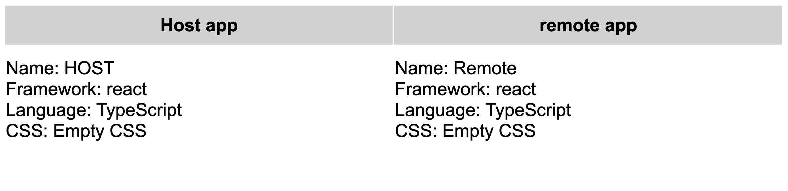

# Microfrontends simple boilerplate

## Brief description

1. Based on Webpack's plugin -- `ModuleFederationPlugin` (Webpack 5+);
2. Host loads remote chunks dynamically (see `host/src/loadFederatedModule.ts`);
3. You can expose single component or micro application (app fragment);
4. Host could be used as a remote to another host (bidirectional hosts);

## Running the app

First clone the repository, then prepare a remote fragment to be available to the host:
1. `cd remote`
2. `yarn install`
3. `yarn build`
4. `yarn start`

Then we should prepare a host:

5. `cd ../host`
6. `yarn install`
7. `yarn start`

Run `http://localhost:3000/` in your browser, and you will (probably) see the following:

The left part -- is a component from the host application itself, yet the right hand side -- is a remote component (a.k.a. micro frontend fragment) which is loaded by the module federation plugin.
