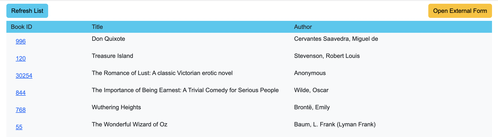
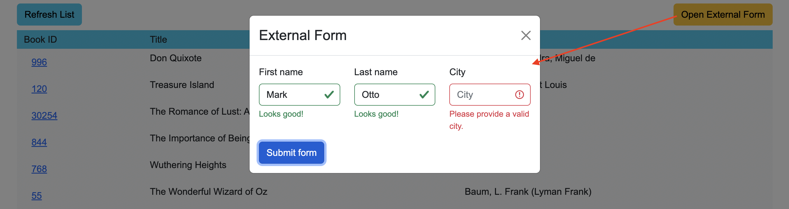

# Microfrontends Architecture Example

## Brief description

1. Based on Webpack's plugin -- `ModuleFederationPlugin` (Webpack 5+);
2. Host loads remote chunks dynamically (see `host/src/loadFederatedModule.ts`);
3. You can expose single component or micro application (app fragment);
4. Host could be used as a remote to another host (bidirectional hosts);

## Running the app

First clone the repository, then go through every dir (`api-server`, `host-list`, `list-remote`, `login-remote` and `form-remote`) and do the following:
1. `cd api-server`
2. `yarn install`
4. `yarn start`

Run `http://localhost:3004/` in your browser, and you will see the following:

Login form is a microfrontend. Login/pass could be any non-empty string at the moment. Also, you can configure the appearance - as a plain form, or it could appear in a popup. After successful login you will be redirected to the list screen: 

this the list made by `list-remote` micro-frontend. Mind the list's `GET` request (`Authorization` header) - it uses `authToken` which arrived to `login` MF component -- we use `Observable`s to inject it safely all over the app.

If you click the left top button `Open External Form`, it will show you the popup with the form loaded as a micro-frontend from `form-remote`:

